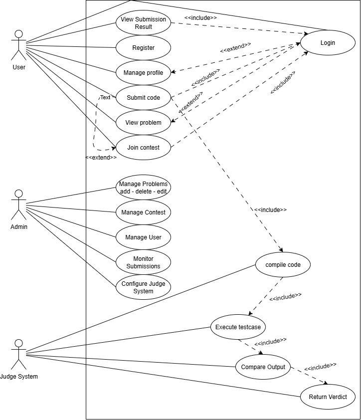

## Cấu trúc BKAC OJ dự đoán

```bash
frontend-onlinejudge/
├── index.html
├── package.json
├── vite.config.ts
├── tailwind.config.cjs
├── tsconfig.json
├── public/
│   └── favicon.ico
├── src/
│   ├── main.tsx
│   ├── index.css
│   ├── constants/
│   │   ├── api.ts          # endpoint URLs
│   │   ├── routes.ts       # route paths
│   │   └── config.ts
│   ├── types/
│   │   ├── problem.type.ts
│   │   ├── submission.type.ts
│   │   ├── user.type.ts
│   │   └── contest.type.ts
│   ├── utils/
│   │   ├── format.ts       # format time, memory, verdicts
│   │   ├── auth.ts
│   │   └── fetcher.ts      # wrapper cho axios/fetch
│   ├── apis/
│   │   ├── auth.api.ts
│   │   ├── problem.api.ts
│   │   ├── submission.api.ts
│   │   └── contest.api.ts
│   ├── contexts/
│   │   └── auth.context.tsx
│   ├── hooks/
│   │   ├── useAuth.ts
│   │   └── useProblems.ts
│   ├── layouts/
│   │   ├── MainLayout/
│   │   │   ├── MainLayout.tsx
│   │   │   └── index.ts
│   │   └── ContestLayout/
│   │       ├── ContestLayout.tsx
│   │       └── index.ts
│   ├── components/
│   │   ├── Navbar/
│   │   ├── Sidebar/
│   │   ├── ProblemCard/
│   │   ├── SubmissionTable/
│   │   └── UserAvatar/
│   ├── pages/
│   │   ├── Home/
│   │   │   └── Home.tsx
│   │   ├── Login/
│   │   │   └── Login.tsx
│   │   ├── Register/
│   │   │   └── Register.tsx
│   │   ├── Problems/
│   │   │   ├── ProblemList.tsx
│   │   │   └── ProblemDetail.tsx
│   │   ├── Submissions/
│   │   │   ├── SubmissionList.tsx
│   │   │   └── SubmissionDetail.tsx
│   │   ├── Contests/
│   │   │   ├── ContestList.tsx
│   │   │   └── ContestDetail.tsx
│   │   └── User/
│   │       └── User.tsx
│   └── routes/
│       └── index.tsx        
```


## Use-case Diagram
